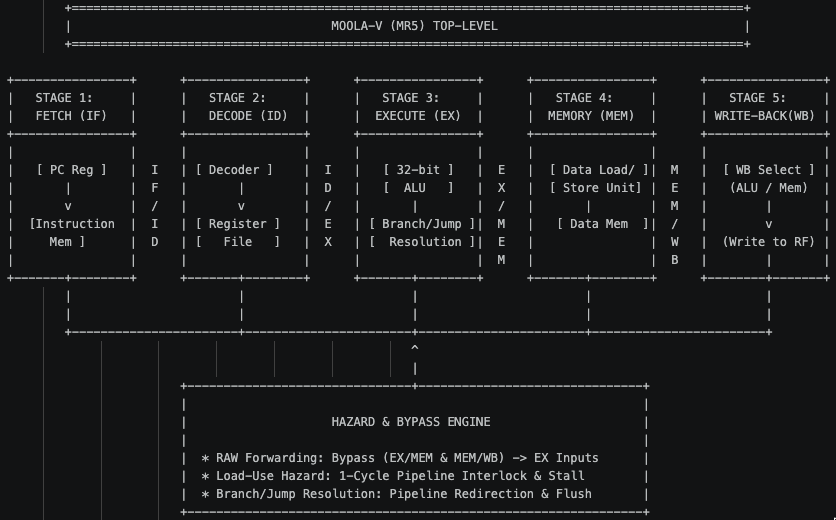

# Moola-V (MR5): 5-Stage Pipelined RV32I Processor Core

[](https://en.wikipedia.org/wiki/SystemVerilog)
[](https://riscv.org/)
[](http://iverilog.icarus.com/)
[](LICENSE)

---

## 💡 Origin & Motivation

Designing a functional RISC-V processor from the ground up has been on my bucket list for a long time. With my semester break underway, I am taking this opportunity to dive deep into digital microarchitecture and processor design hands-on.

As a beginner in processor microarchitecture, my philosophy for this project is straightforward: **learn by building, breaking, analyzing waveforms, and debugging every single pipeline stage from scratch.**

### Why "Moola"?
In **Kannada (ಮೂಲ)**, the word **"Moola"** translates to **"Origin"**, **"Source"**, or **"Root Foundation"**. 

This name represents the essence of this project: building a clean-slate fundamental baseline integer processor core that serves as the root foundation for future microarchitectural explorations (such as hardware multipliers, branch predictors, cache controllers, and SoC peripherals).

---
## 📐 Microarchitecture Overview




## 🎯 Target Specifications & Feature Set

This is an iterative, evolving design. The baseline target specifications for the initial milestone include:

* **Instruction Set Architecture (ISA):** 32-bit RISC-V Base Integer ISA (**RV32I**)
  * Support for all 37 base instructions across R, I, S, B, U, and J formats.
  * Standard 32 general-purpose architectural registers ($x0$ hardwired to 0).
* **Pipeline Microarchitecture:** Classical 5-stage in-order execution datapath:
  1. **Fetch (IF):** Program Counter sequencing with redirection logic.
  2. **Decode (ID):** Instruction decode, immediate sign-extension, and strict operand address filtering.
  3. **Execute (EX):** Standalone parameterized ALU and branch condition evaluation.
  4. **Memory (MEM):** Byte-addressable load/store handling with byte-enable masking.
  5. **Write-Back (WB):** Register file write-back with internal forwarding/write-through.
* **Hazard Management & Datapath Efficiency:**
  * Full RAW data forwarding network (EX-to-EX and MEM-to-EX operand bypassing).
  * Hardware Load-Use Hazard Detection Unit with automated 1-cycle interlock stalling.
  * Single-cycle pipeline cancellation and flushing on taken branches/jumps.
* **Memory Subsystem:** True Dual-Port (TDP) Byte-Enable SRAM interface ready for FPGA Block RAM (BRAM) inference.

---

## 🛠️ Toolchain & Software Stack

This project strictly utilizes open-source, vendor-neutral EDA tools:

| Category | Tool | Purpose |
| :--- | :--- | :--- |
| **HDL Language** | SystemVerilog (IEEE 1800-2012) | Synthesizable RTL design & verification |
| **Simulation** | Icarus Verilog (`iverilog`) / Verilator | Logic compilation, event-driven & cycle simulation |
| **Waveform Debug** | GTKWave | Signal tracing, bus inspection & hazard verification |
| **Toolchain & ISS** | GNU RISC-V GCC / Spike / Whisper | Bare-metal software compilation & golden model checking |
| **Synthesis & PnR** | Yosys / OpenROAD *(Planned)* | Open-source ASIC synthesis and implementation |

---

## 📁 Repository Structure

```text
moola_riscv_core/
├── rtl/        # Synthesizable SystemVerilog RTL modules (To be populated iteratively)
├── tb/         # Self-checking testbenches & verification environments
├── software/   # Bare-metal assembly & C test programs
├── sim/        # Simulation scripts, executables, and waveform outputs
├── docs/       # Microarchitectural specs, block diagrams, and timing charts
├── .gitignore  # Exclusion list for simulation artifacts
└── README.md   # Project documentation & progress tracker


🚀 Development Roadmap & Learning Journey
[x] Milestone 0: Architecture Specification & Project Kickoff

[ ] Milestone 1: ALU, Register File, and Instruction Decoder Modules

[ ] Milestone 2: 5-Stage Pipeline Registers & Datapath Assembly

[ ] Milestone 3: Hazard Detection & Operand Forwarding Bypass Networks

[ ] Milestone 4: True Dual-Port SRAM Memory Subsystem Integration

[ ] Milestone 5: Official RISC-V Architectural Compliance Test Suite (riscv-tests)

[ ] Milestone 6: Co-Simulation with Spike ISS via DPI-C


🤝 Community & Feedback
This repository is built in public to document my engineering takeaways, microarchitecture trade-offs, and simulation hurdles step-by-step.

Suggestions, architecture advice, and code reviews from digital design and computer architecture engineers are warmly welcomed! Feel free to open an issue or start a discussion.


Author: Anand Nagaraj
GitHub: @AnandNag003